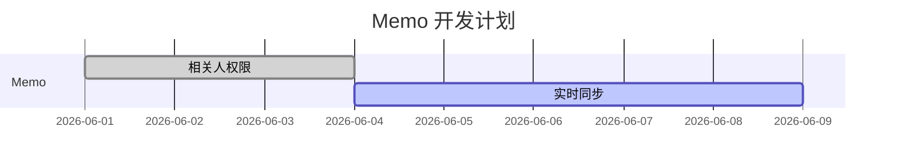

# UniComm Desktop

Tauri 2 + React 19 企业协同桌面应用

## 技术栈

- **Tauri 2.x** - Rust 后端桌面框架
- **React 19.x** - UI 框架
- **Vite 6.x** - 构建工具
- **TypeScript 5.x** - 类型安全
- **TailwindCSS 4.x** - 原子化 CSS
- **Zustand 5.x** - 状态管理
- **TanStack Query 5.x** - 服务端状态
- **React Router 7.x** - 路由
- **Milkdown Crepe 7.x** - Memo 可视化 Markdown 编辑器
- **shadcn/ui + Radix UI** - 前端基础组件体系
- **Alibaba PuHuiTi 3.0** - 中日文界面首选字体

## 项目结构

```
unicomm-desktop/
├── src/                      # React 前端源码
│   ├── desktop/              # 桌面能力层 (Tauri 封装)
│   ├── native/               # Native 抽象层
│   ├── features/             # 功能模块 (领域驱动)
│   │   ├── auth/             # 认证模块
│   │   ├── memo/             # 备忘录模块
│   │   └── settings/         # 设置模块
│   ├── i18n/                  # 中日文国际化文案
│   ├── assets/fonts/          # 内置字体文件
│   ├── stores/               # 全局状态
│   ├── components/          # 公共组件
│   ├── services/             # 服务层
│   └── styles/               # 样式
├── src-tauri/                # Tauri/Rust 后端
│   └── src/commands/         # Rust 命令
└── package.json
```

## 开发

### 前置要求

- Node.js 20+
- Rust 1.70+
- npm

### 安装依赖

```bash
cd ~/Project/unicomm-desktop
npm install
```

### 开发模式

```bash
# 启动 Vite 前端开发服务器
npm run dev

# 在另一个终端启动 Tauri
npm run tauri dev
```

### 生产构建

```bash
npm run tauri build
```

Vite 构建不再手动按包名拆分 Milkdown 内部依赖，避免 Rollup circular chunk 警告。Memo 编辑器通过 `React.lazy` 懒加载，Milkdown/Mermaid 相关体积集中在编辑器异步 chunk 中，`vite.config.ts` 将 chunk 提示阈值调整为 1800KB 以匹配该真实异步块大小。

## 功能状态

### 已实现 ✅
- [x] Tauri 2 项目初始化
- [x] React 19 + TypeScript 配置
- [x] TailwindCSS 4 主题系统 (light/dark/system)
- [x] 桌面用户信息读取 (Rust whoami)
- [x] 设备信息获取
- [x] 认证状态管理 (Zustand)
- [x] 认证状态视图组件
- [x] HTTP 请求服务 (Axios)
- [x] 基础布局：侧边栏 + 应用内自定义标题栏
- [x] 主窗口关闭原生标题栏，标题栏颜色跟随主题
- [x] shadcn/ui 基础组件
- [x] Memo 工作台：列表、分组筛选、状态筛选、用户维度置顶、用户维度收藏、删除、Milkdown 可视化编辑、MD 源码/双栏模式
- [x] Memo 与我相关视图：只显示别人共享给当前用户的 Memo
- [x] Memo 相关人权限：相关人支持只读和可编辑标题/正文/状态两种权限
- [x] Memo 可视化编辑：支持 TopBar、表格、代码块、公式等常用 Markdown 排版能力
- [x] Memo 图片插入：本地图片转 base64 后作为 Markdown 图片保存到 content
- [x] Memo 图形渲染：支持 Mermaid 流程图、甘特图、时序图等图形代码块
- [x] 侧边栏图标区：通知、设置、亮暗主题切换和当前人员信息
- [x] 快速 Memo 小窗口
- [x] 系统托盘与后台运行
- [x] 全局快捷键
- [x] 设置页快捷键配置
- [x] 中文/日文界面切换
- [x] 阿里巴巴普惠体 3.0 / Alibaba Sans JP 内置字体
- [x] WebSocket 实时连接与 Memo 变更刷新

### 开发中 🚧
- [ ] 通知模块完善（桌面通知、通知持久化）
- [ ] 剪贴板

## 前端组件体系

- 基础交互组件采用 shadcn/ui 风格，组件源码放在 `src/components/ui/`
- 主题、圆角、边框、焦点态继续复用 `src/styles/globals.css` 中的 CSS 变量
- 优先使用 `Button`、`Input`、`Textarea`、`Tabs`、`Badge` 等公共组件，避免在业务页面重复手写基础控件
- 复杂控件按功能逐步迁移到 Radix/shadcn 组合，避免一次性重写影响 Memo 保存、相关人权限、快捷键等已实现功能
- 暂保留兼容原生 `<select>` 的 `Select` 包装组件；后续如改为 Radix Select，需要逐个迁移调用方的 `<option>` 写法

## 字体与语言

- 默认语言：中文 (`zh-CN`)
- 可选语言：中文 (`zh-CN`) / 日文 (`ja-JP`)
- 设置位置：主界面侧边栏 `设置` -> `语言与字体`
- 中文首选字体：阿里巴巴普惠体 3.0
- 日文首选字体：Alibaba Sans JP
- 字体文件目录：`src/assets/fonts/`
- 首次启动时根据系统语言选择默认语言：`zh-*` 使用中文，`ja-*` 使用日文，未支持语言回退中文
- 用户在设置页手动切换语言后，以本地保存的用户设置为准

当前已内置常用 UI 字重：

- `AlibabaPuHuiTi-3-55-Regular.woff2`
- `AlibabaPuHuiTi-3-65-Medium.woff2`
- `AlibabaPuHuiTi-3-85-Bold.woff2`
- `AlibabaSansJP-Regular.woff2`
- `AlibabaSansJP-Medium.woff2`
- `AlibabaSansJP-Bold.woff2`

`src/styles/globals.css` 通过 `@font-face` 加载项目内字体。若字体文件加载失败，会继续回退到对应语言的系统字体。

## WebSocket 实时同步

- 默认地址：根据 `VITE_API_BASE_URL` 自动推导为同源 `/ws`
- 可通过 `VITE_WS_URL` 显式覆盖，例如 `ws://localhost:28080/ws`
- 认证通过后自动连接，断线后自动重连
- 收到 `memo.*` 或 `group.*` 事件后刷新 Memo 数据
- `group.*` 事件只刷新分组数据，`memo.*` 事件只静默刷新 Memo 列表，避免全局 loading 造成界面闪烁
- 首屏加载、分组加载和相同筛选条件下的 Memo 列表加载会复用进行中的请求，避免刷新页面时重复调用接口

## 通知规则

- 当前用户在事件接收人列表中时，前端会刷新对应 Memo/分组数据
- 事件发起人是当前用户时，仅刷新数据，不写入通知中心
- 事件发起人不是当前用户时，`memo.created`、`memo.updated`、`memo.deleted`、`memo.related.updated` 写入通知中心
- `group.*` 事件只刷新分组，不生成通知
- 置顶和收藏是个人状态，由接口返回值在操作者本地更新，不广播实时事件，也不生成通知

## Memo 编辑器

- 可视化编辑器使用 `@milkdown/crepe`，开源协议为 MIT，可免费商用
- `Ctrl + S` / `Command + S` 会保存当前 Memo，并拦截浏览器默认保存页面行为
- 正在编辑的 Memo 会保留本地草稿；分组保存、WebSocket 刷新或列表静默刷新不会覆盖未保存内容
- Memo 列表采用首屏分页加载和滚动追加：首屏请求 30 条，滚动到底部后继续请求下一页，避免一次性全量加载拖慢界面
- Memo 列表排序统一为“置顶优先 / 更新时间倒序 / ID 倒序”，新建、保存、置顶和刷新后的显示顺序保持一致
- 默认使用可视化编辑；编辑模式切换顺序为“可视化 / MD 源码 / 双栏”
- 双栏模式左侧为可视化编辑区，右侧为 MD 源码区；低分辨率下上下分区显示
- 双栏模式下左侧是只读预览，避免可视化格式化结果反向影响右侧源码输入
- 图片当前通过 Crepe 上传回调转为 base64 data URL，并以 Markdown 图片语法保存到 `content`
- 后续接入服务端上传接口时，可以把图片上传回调替换为“上传文件并返回 URL”的实现，业务数据结构不需要调整
- Mermaid 图形通过 `mermaid` 代码块保存，视觉区会渲染为 SVG。示例：

````markdown

````

## 窗口与桌面能力

- 主窗口在 `src-tauri/tauri.conf.json` 中设置 `decorations: false`，避免 Windows 原生标题栏和应用内标题栏重复显示
- 应用内标题栏由 `src/components/layout/AppLayout.tsx` 绘制，支持拖拽、最小化、最大化、关闭
- 标题栏背景使用主题变量，浅色/深色模式下与页面主题保持一致
- UI 密度按高 DPI / 200% 缩放优化：侧边栏 190px、Memo 列表 280px、标题栏 32px、编辑区 12px 内边距
- 主窗口默认尺寸为 1440x800，最小宽度为 1024，兼顾双栏编辑和低分辨率设备
- Memo 工作区禁用浏览器默认右键菜单；在 Memo 列表项右键时展示自定义菜单，支持置顶、收藏、删除
- 快速 Memo 使用独立 Tauri 窗口，默认隐藏，由全局快捷键唤出
- 主窗口关闭时隐藏到后台，系统托盘菜单支持显示、隐藏、退出

## Tauri IPC 与安全

- 桌面端运行时可能看到对 `ipc.localhost` 的请求，这是 Tauri 内部 IPC 通道，不是外部网站
- 前端通过 `@tauri-apps/api` 使用该通道调用 Rust 命令、窗口控制、事件、托盘、快捷键等桌面能力
- 当前开发配置中 `src-tauri/tauri.conf.json` 的 `security.csp` 为 `null`，便于本地调试；发布 Windows 安装包前需要配置 CSP
- 不应在拥有 Tauri IPC 权限的窗口中加载不可信远程页面；后续新增窗口或外链能力时，需要同步检查 capabilities 和 CSP

## 认证流程

1. 应用启动 → 读取当前 Windows 用户信息和设备信息
2. 调用 `/api/v1/auth/desktop/verify` 验证用户
3. 根据认证状态显示不同视图
4. 成功后进入主界面

桌面端返回给前端的 Tauri 命令字段统一使用 `camelCase`，与 TypeScript 类型保持一致。Windows 域信息优先从 `USERDOMAIN / USERDNSDOMAIN` 读取；本机账户场景下如果域值等于计算机名，则不作为企业域返回。

## 备注

- 当前主要开发环境为 macOS，Windows 专属行为需要在 Windows 真机上验收
- Windows 托盘、全局快捷键、无原生标题栏窗口边缘行为仍需在 Windows 真机上做最终验收
